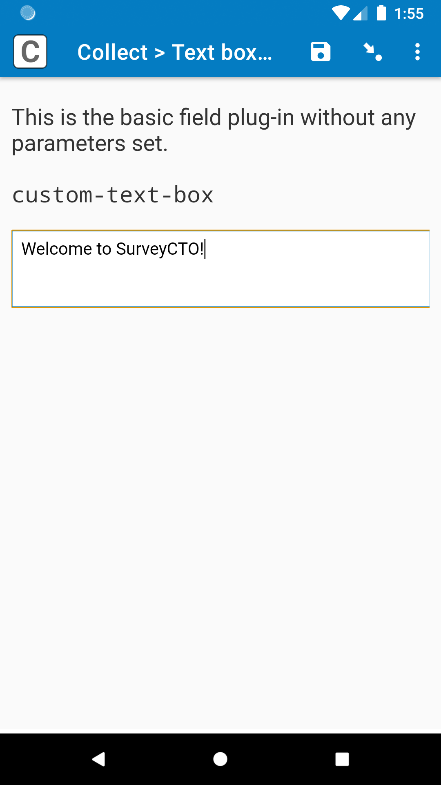
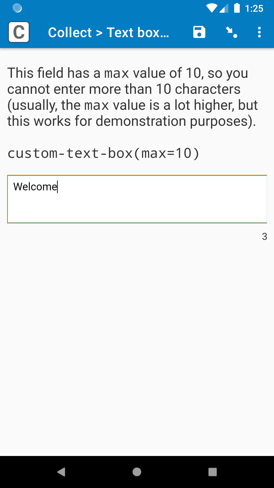
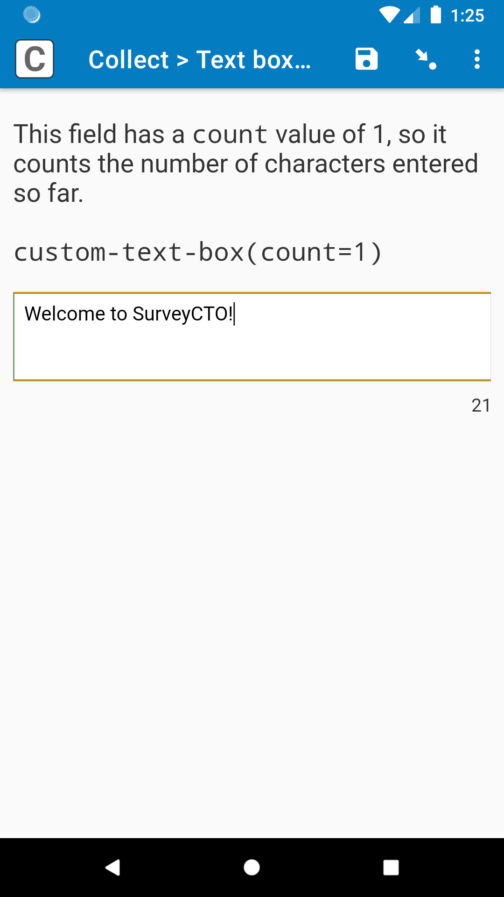
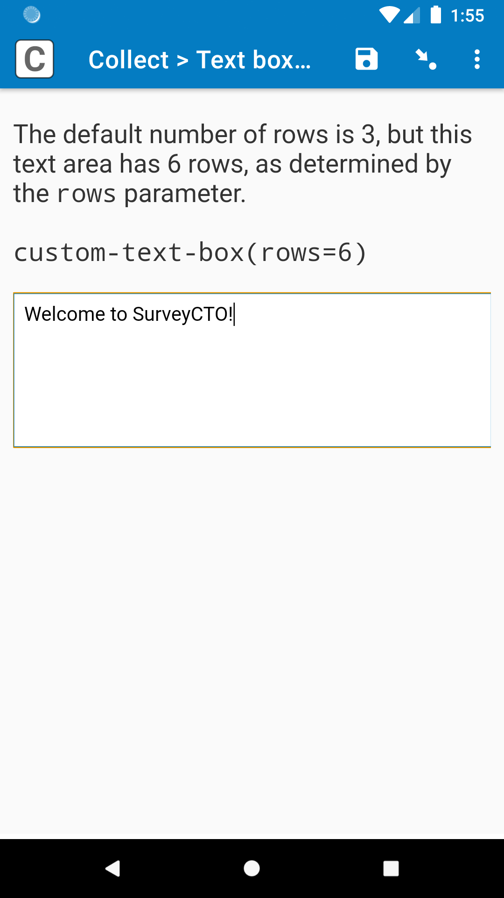

# Text box

||||
|:---:|:---:|:---:|
|Max|Count|6 rows|

## Description

Use this field plug-in if text responses will be somewhat longer, and you would like to have a larger text box to enter the data. You can also use this field plug-in to add a limit to the amount of text that can be entered, without needing to check it against a *constraint*.

*This plug-in is currently under beta. If you you find a problem with the field plug-in, please email support@surveycto.com, or submit an issue to this GitHub repo.*

### Features

* Larger text box with customizable size
* Limit number of characters that can be entered
* Show character count
* Set to expand to fit content, just like in fields without field plug-ins
* Set maximum expansion size

This field plug-in also inherits functionality from the [baseline-text](https://github.com/surveycto/baseline-text/blob/master/README.md) field plug-in.

### Requirements

For full use of all features on Android, Android 7 or up is required. However, the field plug-in will still work well on older versions of Android. Here is a list of limitations on older versions of Android:

* Different <i>appearance</i>s ("numbers", "numbers_decimal", and "numbers_phone") will not work properly
* When using the `expand` [parameter](#parameters), the box will not completely expand to fit all content, but it will be close, within a few pixels

Because web browsers and iOS devices are kept more up-to-date with the latest features, nearly all web browsers and iOS devices should support the field plug-in, but test it on your collection device beforehand to be sure.

### Data format

This field returns the text entered into the text box.

## How to use

### Getting started

**To use this field plug-in as-is:**

1. Download the [sample form](https://github.com/surveycto/text-box/blob/main/extras/sample-form/Text%20box%20sample%20form.xlsx?raw=true) from this repo and upload it to your SurveyCTO server.
1. Download the [text-box.fieldplugin.zip](https://github.com/surveycto/text-box/raw/main/text-box.fieldplugin.zip) file from this repo, and attach it to the sample form on your SurveyCTO server.

### Parameters

|Name|Description|
|---|---|
|`rows` (optional)|The number of rows in the text box shown at a time. In other words, the height of the text box. Behavior is different if `expand` has a value of `1`; see the `expand` parameter below for details. Default: 3|
|`max` (optional)|The maximum number of characters that can be entered into the text box. If this parameter has no value, then there is no limit. This is helpful if you would like to make sure enumerators/enumerators do not enter too much information. It will also have a countdown showing the number of characters remaining.|
|`count` (optional)|Whether or not to show the character count so far. The character count is hidden by default, but shown by default when `max` is specified. Here is a breakdown of the behavior of `count`:<ul><li>**`max` has a numeric value, and `count` is not specified**: The field will show the number of characters remaining.</li><li>**`max` has a numeric value, and `count` has a value of `0`**: The count will be hidden.</li><li>**`max` has no value, and `count` is not specified**:  The count will be hidden.</li><li>**`max` has no value, and `count` has a value of `1`**: The field will show the number of characters entered so far.</li></ul>|
|`expand` (optional)|
If this parameter has a value of `1`, then the text box will expand to fit the content. This can be helpful if you would like enumerators to be able to easily view all content they have entered at once. This is also the default behavior of fields without field plug-ins.

Also, when `expand` has a value of `1`, instead of the `rows` parameter being used to determine the number of rows that will be shown, it defines the maximum number of rows it will expand to. For example, if `expand` has a value of `1`, and `rows` has a value of `5`, then the text box will expand until it is 5 rows tall, and then the enumerator will have to scroll to view the rest of the content.
|

This field also inherits the parameter from the [baseline-text](https://github.com/surveycto/baseline-text/blob/master/README.md) field plug-in, but it is only needed in special cases when collecting data using an iOS device. Check out that field plug-in's section on [parameters](https://github.com/surveycto/baseline-text#parameters) to learn more.

### Default SurveyCTO feature support

| Feature / Property | Support |
| --- | --- |
| Supported field type(s) | `text`|
| Default values | Yes |
| Constraint message | Uses default behavior |
| Required message | Uses default behavior |
| Read only | Yes *(shows the current value, if present)* |
| media:image | Yes |
| media:audio | Yes |
| media:video | Yes |
| `numbers` appearance | Yes*† |
| `numbers_decimal` appearance | Yes* |
| `numbers_phone` appearance | Yes* |

\* Supported on Android 7 and up only. See [requirements](#requirements) above for more info.

† Some mobile devices may not allow negative numbers when using the "numbers" *appearance*. If you need to collect negative numbers, you may want to use "numbers_decimal" instead.

## More resources

* **Sample form**  
You can find a form definition in this repo here: [extras/sample-form](extras/sample-form).

* **Developer documentation**  
More instructions for developing and using field plug-ins can be found here: [https://github.com/surveycto/Field-plug-in-resources](https://github.com/surveycto/Field-plug-in-resources)